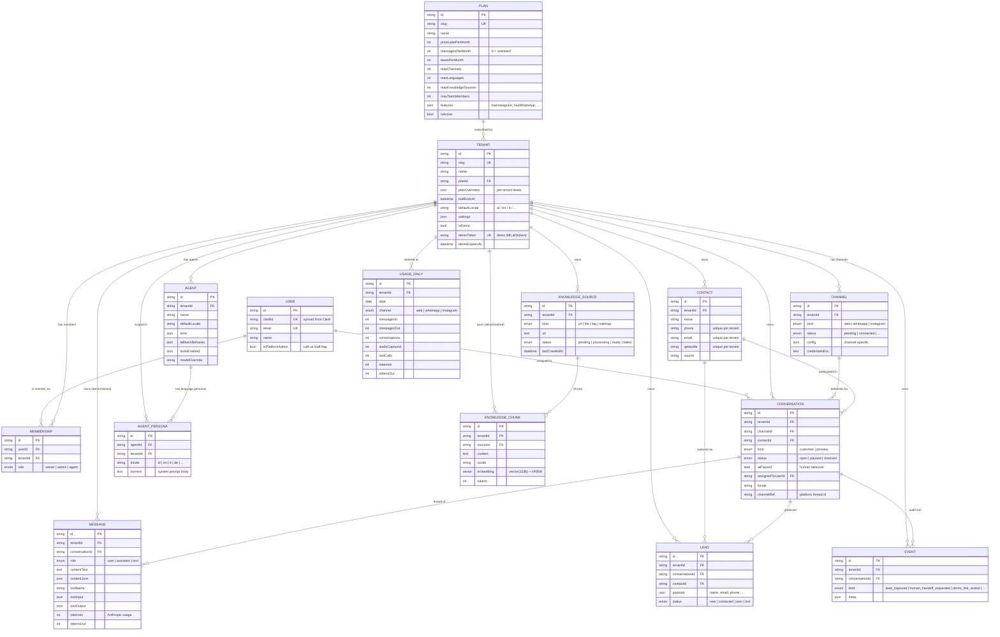
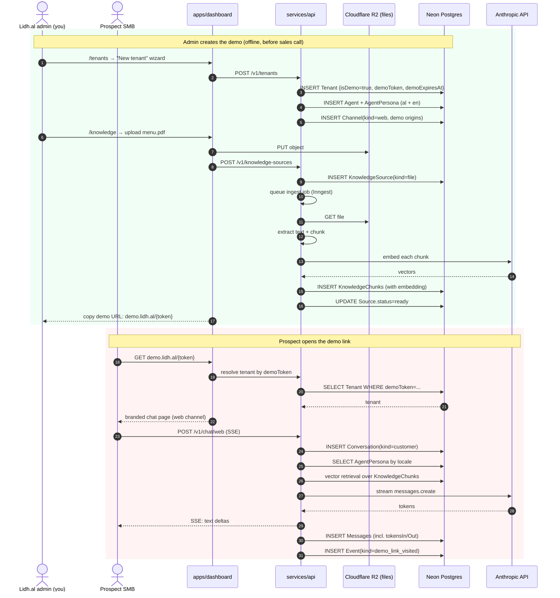
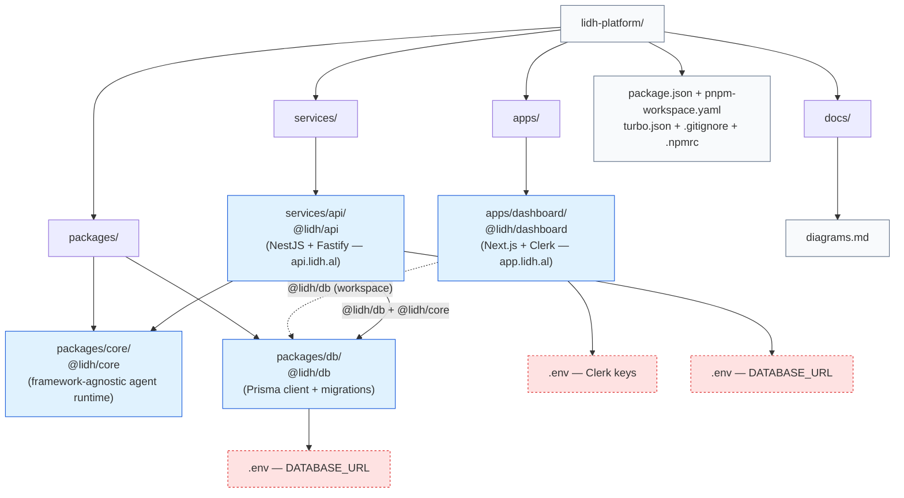

# Lidh.al Platform — Diagrams

Snapshot of the platform as of M1 completion (foundation milestone). Each
diagram is Mermaid — draw.io renders Mermaid natively.

## How to import into draw.io

1. Open https://app.diagrams.net (or the desktop app).
2. **For each diagram below:** Extras → Edit Diagram → paste the Mermaid block
   (everything between the ` ```mermaid ` fences, *including* those fences if
   the import dialog asks for them, otherwise just the inner code).
3. Or, on the menu bar: **+ → Advanced → Mermaid** → paste.
4. Each block becomes its own draw.io page; you can rearrange afterwards.

> **Tip:** If a diagram looks crowded after import, pick "Layout → Hierarchical"
> (or for the ERD, "Layout → Organic") and draw.io re-flows it.

---

## 1. System Architecture (M1 current state)

What's running where, and what talks to what.

```mermaid
graph TB
  classDef user fill:#FFEFD5,stroke:#F97316,color:#0A0A23
  classDef app  fill:#E0F2FE,stroke:#1E5FDB,color:#0A0A23
  classDef svc  fill:#DCFCE7,stroke:#16A34A,color:#0A0A23
  classDef ext  fill:#F3E8FF,stroke:#9333EA,color:#0A0A23
  classDef pkg  fill:#F8FAFC,stroke:#64748B,color:#0A0A23,stroke-dasharray:3 3

  visitor(["Customer / Visitor"]):::user
  smb(["SMB owner / Lidh.al admin"]):::user

  subgraph Vercel
    dashboard["apps/dashboard<br/>Next.js — app.lidh.al<br/>Clerk gate on /inbox*"]:::app
  end

  %% Marketing site (lidh.al) lives in its own repo (ADR-012) — not shown here.

  subgraph FlyIo["Fly.io (Frankfurt)"]
    api["services/api<br/>NestJS + Fastify<br/>GET /v1/health"]:::svc
  end

  subgraph WorkspacePackage["Workspace package"]
    db["packages/db<br/>#64;lidh/db — Prisma client + types"]:::pkg
  end

  subgraph ManagedServices["Managed services"]
    neon[("Neon Postgres<br/>+ pgvector + HNSW")]:::ext
    clerk["Clerk Auth<br/>magic-link email"]:::ext
    anthropic["Anthropic API<br/>claude-haiku-4-5"]:::ext
  end

  visitor -.web widget / demo links.-> dashboard
  smb --> dashboard

  dashboard -- magic-link login --> clerk
  clerk -. webhook user.created/updated/deleted .-> dashboard
  dashboard -.M2: tenant data.-> api

  dashboard -- imports types from --> db
  api       -- imports prisma from --> db
  db        --> neon

  api -.M2: agent runtime.-> anthropic
```

**Solid arrows** = wired in M1. **Dashed arrows** = stubbed (route exists, body
deferred to M2) or planned.

---

## 2. Database schema — full ERD (15 tables, all relationships)

The complete data model committed in `packages/db/prisma/schema.prisma`. Every
domain row has `tenantId` (RLS in M2). Identity (`User`) is global.



---

## 3. User actions — sign-up + sign-in (current implementation)

What actually happens when an SMB owner (or you, as platform admin) signs in.
Webhook step is stubbed in M1; real upsert lands in M2.

```mermaid
sequenceDiagram
  autonumber
  actor U as User (SMB owner / admin)
  participant B as Browser
  participant D as apps/dashboard<br/>(Next.js)
  participant MW as Clerk middleware.ts
  participant CK as Clerk
  participant WH as POST /api/webhooks/clerk
  participant DB as Neon Postgres<br/>(via @lidh/db)

  U->>B: open app.lidh.al
  B->>D: GET /
  D->>MW: middleware runs
  MW->>CK: read session
  CK-->>MW: signed-out
  D-->>B: 307 → /sign-in
  B->>D: GET /sign-in
  D-->>B: Clerk SignIn UI

  U->>B: enter email + submit
  B->>CK: POST sign-in (publishable key)
  CK-->>U: email with verification code
  U->>B: paste code
  B->>CK: verify
  CK-->>B: session JWT (cookie)

  Note over CK,WH: M2: Clerk fires webhook user.created
  CK->>WH: POST signed payload
  WH->>WH: svix verify signature
  WH->>DB: M2 → prisma.user.upsert by clerkId
  Note right of WH: M1 just logs; no DB write yet

  B->>D: GET /
  D->>MW: middleware runs
  MW->>CK: verify JWT
  CK-->>MW: signed-in (userId)
  D-->>B: 307 → /inbox

  B->>D: GET /inbox
  D->>MW: middleware runs (protected route)
  MW-->>D: allow (auth.protect passes)
  D-->>B: 200 — Inbox page<br/>(empty stub, header + UserButton)
```

---

## 4. Future flow — admin creates a demo for a prospect (M2 preview)

Diagram for context: this is the flow we built the schema for, but **not yet
implemented**. Worth keeping in the diagrams folder so M2 has a north star.



---

## 5. Monorepo file structure (M1)

A minimap of where things live in the repo as of M1.



Red dashed boxes = local secret files (gitignored, not committed).

---

## What each diagram is for

| Diagram | Purpose | Audience |
|---|---|---|
| 1. System Architecture | One-glance answer to "where does the code run?" | New collaborators, you in 6 months |
| 2. ERD | Authoritative reference for any "what data do we have?" question | You while building features |
| 3. Sign-up sequence | Concrete walkthrough of the auth flow as it works today | Debugging Clerk issues |
| 4. Demo flow (planned) | North star for M2 build order | You during M2 sprint |
| 5. Monorepo map | Which folder holds what | You ten minutes into a refactor |

These should evolve with the code. When schema changes (e.g., adding a model
in M2), update Diagram 2. When the agent runtime exists, Diagram 4 becomes
"current state" instead of "planned."
